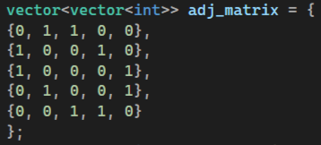
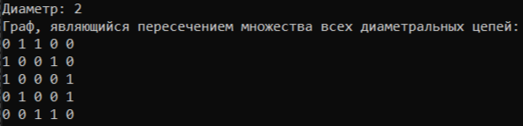

# Отчет по расчетной работе по дисциплине ПиОИвИС

## Цель
Ознакомиться с основами теории графов, способами представления графов, базовыми алгоритмами для работы с разными видами графов.

## Задача
Построение графа: Найти граф, являющийся пересечением множества всех диаметральных цепей неориентированного графа Граф задается матрицей смежности, вывод работы программы выводится в консоль.
## Вариант 3.2(нг, мс)

## Ключевые понятия
- Граф - совокупность двух множеств множества самих объектов, называемого множеством вершин, и множества их парных связей, называемого множеством рёбер.
- Неориентированный граф - граф, в котором ребра не имеют направления, то есть связь между вершинами двусторонняя.
- Матрица смежности - квадратная матрица размера 𝑛×𝑛, где 𝑛 - количество вершин в графе. Каждый элемент матрицы [i][j] указывает наличие (1) или отсутствие (0) ребра между вершинами 𝑖 и 𝑗.
- Диаметром графа называется наибольшее расстояние между двумя его вершинами.

## Алгоритм решения
Ввод данных:
Задайте матрицу смежности графа, которая определяет его структуру.

2.Вычисление диаметра графа:
Для каждой вершины:
-Инициализируйте массив visited для отслеживания посещённых вершин.
-Создайте очередь q и добавьте текущую вершину.
-Установите уровень (level) в 0.
-Пока очередь не пуста. Для каждой вершины в очереди:
-Найдите её соседей.
--Если сосед не посещён, добавьте его в очередь и пометьте как посещённый.
-Увеличьте уровень.
-Обновите максимальный диаметр, если текущий уровень больше.
3.Построение графа пересечения:
-Получите диаметр d с помощью функции из предыдущего шага.
-Инициализируйте результирующую матрицу.
-Для каждой вершины:
-Повторите аналогичные шаги обхода в ширину (BFS).
-Если уровень равен d, добавьте рёбра в результирующую матрицу.
4.Вывод данных:
Выведите диаметр графа и результирующую матрицу пересечения.

